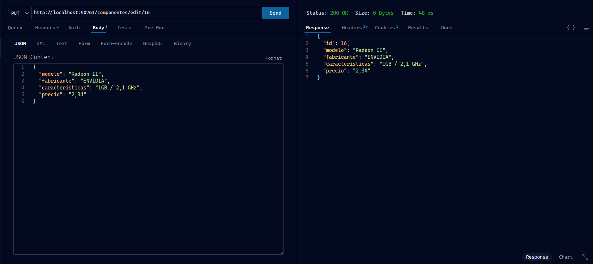

# Documentacion API en Symfony

For this project, I have developed an API for computer components with all CRUD functions. Additionally, as an extra feature, it includes user verification implemented through email and password.

The project involves creating both the API and the web application that utilizes the API requests to display necessary information using the TWIG template engine.

Project components:

* API for components with CRUD operations
* Web application built on the API
* Utilization of the TWIG template engine
* User authentication
* Creation and utilization of a Database

In this document, I will provide the URL for making various possible requests. In this case, they have been carried out using the VS Code [Thunder Client](https://www.thunderclient.com/) extension, which we became acquainted with during the project and appreciated having implemented in our working environment as the tool for testing the API.

All the requests outlined below are utilized in the jointly developed application, and I will specify when each one is used.

From this point onward, the subsequent pages of this document demonstrate the functionality of the API.

## API Functionality

The format for the requests is as follows:
IP : port / {API} / action / {id}

The possible options to use are:

* API
  * 'componentes' for the components part of the API
  * 'users' for the users part of the API
* Action
  * 'get, add, edit, delete' for the components part
  * 'get and register' for the users part
* ID
  * Integer, only available for 'get', 'edit', and 'delete' actions
* Parameters
  * Components
    * 'model' refers to the name of the model
    * 'manufacturer' refers to the manufacturer of the component
    * 'features' properties of the component
    * 'price'
  * Users
    * 'email'
    * 'password'

## Possible requests for Components API

Initial request for all components using the GET method:
	IP/components/get

Request for a specific component using the GET method with an ID:

    IP / components / get / id}

Request to add a component using the POST method with parameters

    IP / componentes / add

    Parameters: 'modelo', 'fabricante', 'caracteristicas' y 'precio'.

Request to add a component using the PUT method with parameters:

Here, there are two options: send all attributes as parameters or only the one you want to modify. I will show both cases.

    IP / componentes / edit / id

    Parameters: modelo, fabricante, características y precio.

    IP / componentes / add

    Parameters:	only the modified one

Request to delete a component using the DELETE method.

    IP / componentes / delete / id

Request to search for a nonexistent component

    IP / componentes / get / id

Request without action

    IP / componentes

## Possible requests for Users API

Request to get all users

    IP / user / get

Request to search for a specific user using the GET method

    IP / user / get / id

Request to register a user using the POST method with parameters:

    IP / user / register

    Parameters: email y password

Request to check the login of a user:

    IP / user / checklogin

    Parámetros: email y password

In case of successful login:

In case of unsuccessful login:

